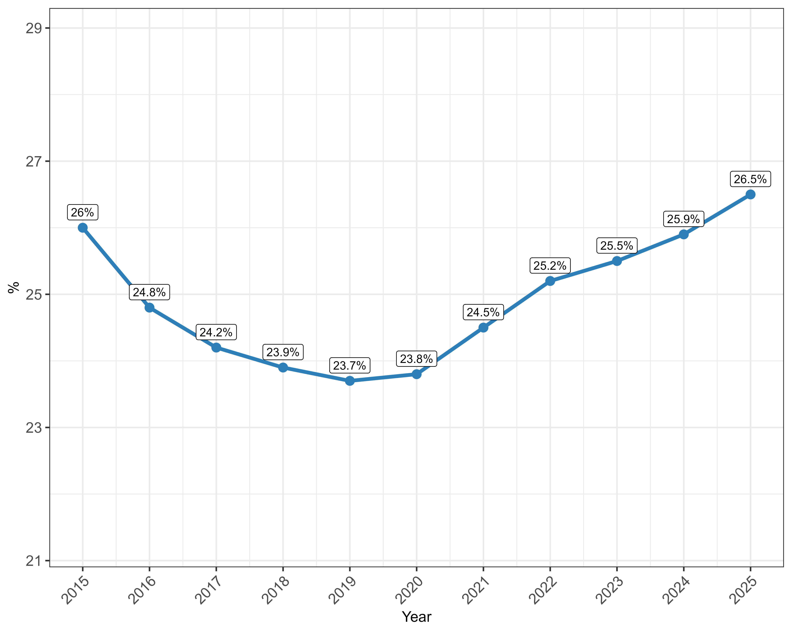
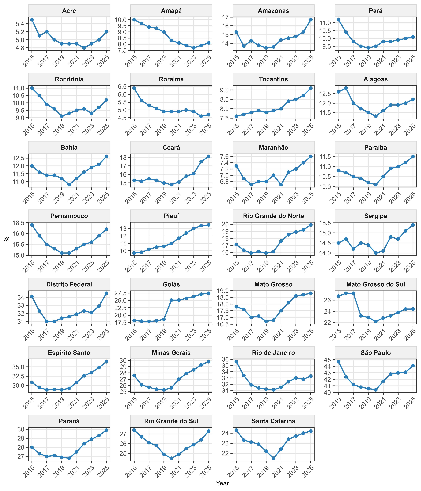
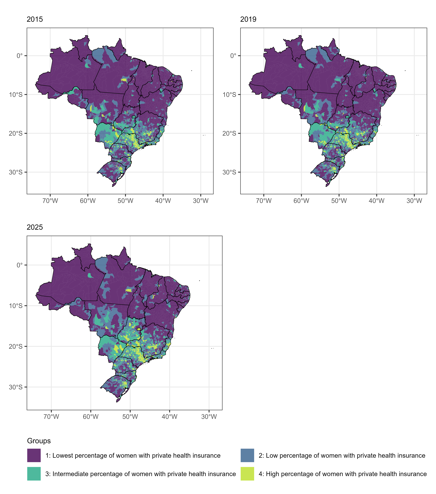

```{=html}
<style>
figcaption {
  color: rgb(55, 58, 60) !important;
  font-size: 0.95rem;
}
</style>
```

```{=html}
<style>
.quarto-figure figcaption {
  text-align: center;
  margin-bottom: 8px;
}

</style>
```

# Introdução

Este relatório tem como objetivo prover as análises para um futuro artigo a ser escrito, no qual temos interesse em estudar o comportamento temporal e espacial da porcentagem de mulheres de 10 a 49 beneficiárias de planos de saúde privados.

# Metodologia

## Desenho do estudo

Este estudo é do tipo ecológico, com dados referentes ao período de 2015 a 2025 e desenvolvido em duas etapas. Na primeira, realizamos uma análise temporal, na qual buscamos avaliar tendências nas séries históricas da porcentagem de mulheres de 10 a 49 anos beneficiárias de planos de saúde privados no Brasil e nas UFs. Na segunda etapa, conduzimos uma análise espacial, na qual aplicamos métodos de agrupamento para identificar grupos de municípios com características semelhantes em relação à porcentagem de mulheres beneficiárias de planos de saúde privados nos anos de 2015, 2019 e 2025, selecionados por representarem diferentes momentos da série histórica desse indicador. Após a definição dos grupos, estes foram comparados em relação a um conjunto de indicadores sociodemográficos e econômicos, a fim de tentar entender quais fatores podem estar associados a maiores ou menores porcentagens de mulheres beneficiárias de planos de saúde privados.

## Variáveis e fontes dos dados

Para todas as análises, o percentual de mulheres de 10 a 49 anos beneficiárias de planos de saúde privados foi utilizado como variável resposta. Os dados de beneficiárias de planos de saúde privados foram obtidos a partir da Agência Nacional de Saúde Suplementar (ANS) [@ansTabnet], enquanto as estimativas populacionais foram obtidas a partir de dados do Instituto Brasileiro de Geografia e Estatística (IBGE), disponibilizados no Tabnet DATASUS [@datasusTabnet].

Para a análise espacial, utilizamos, também, um conjunto de variáveis sociodemográficas e econômicas para caracterizar os grupos de municípios obtidos. Essas variáveis foram selecionadas com base em uma revisão de literatura prévia, na qual identificamos fatores que podem estar associados a maiores ou menores porcentagens de mulheres beneficiárias de planos de saúde privados. Da lista completa de variáveis enviada, foram selecionadas aquelas com correlação superior a 0,5 com o percentual de beneficiárias de planos de saúde e que apresentaram correlação entre si inferior a 0,8. Informações a respeito de todas as variáveis utilizadas na análise estão disponíveis na @tbl-variaveis. Para todos os indicadores, foram utilizadas as últimas informações disponíveis. Com exceção da variável resposta, os dados foram obtidos através das plataformas Atlas Brasil [@atlasBrasil] e Base dos Dados [@basedosdados].

```{python}
#| label: tbl-variaveis
#| tbl-cap: "Information on the variables used in the analysis."

import pandas as pd
from IPython.display import HTML

df = pd.DataFrame(
    [
        [
            'Percentage of women aged 10 to 49 covered by private health insurance plans',
            '2015 to 2025',
            'ANS and IBGE',
            'Tabnet ANS and Tabnet DATASUS',
        ],
        [
            'Ratio between the number of active employment ties and the population aged 15 to 64',
            '2024',
            'Ministry of Labor and Employment and IBGE',
            'Base dos Dados and Tabnet DATASUS',
        ],
        ['Municipal Human Development Index (MHDI)', '2010', 'Atlas Brasil', 'Atlas Brasil'],
        ['Percentage of the population residing in urban areas', '2010', 'IBGE', 'Atlas Brasil'],
        ['Percentage share of Public Administration in the Gross Value Added', '2021', 'IBGE', 'Base dos Dados'],
        ['Percentage of the population covered by Bolsa Família', '2017', 'CadÚnico', 'Atlas Brasil'],
    ],
    columns=['Variable', 'Analysis period', 'Original source', 'Data retrieval source'],
)

html = [
    '<table style="table-layout: fixed; width: 100%; border-collapse: collapse;">',
    '<thead>',
    '<tr>',
    '<th style="text-align:left; padding: 6px 8px;">Variable</th>',
    '<th style="text-align:center; padding: 6px 8px;">Analysis period</th>',
    '<th style="text-align:left; padding: 6px 8px;">Original source</th>',
    '<th style="text-align:left; padding: 6px 8px;">Data retrieval source</th>',
    '</tr>',
    '</thead>',
    '<tbody>',
]

for _, row in df.iterrows():
    html.append('<tr>')
    html.append(f'<td style="text-align:left; padding: 6px 8px;">{row["Variable"]}</td>')
    html.append(f'<td style="text-align:center; padding: 6px 8px;">{row["Analysis period"]}</td>')
    html.append(f'<td style="text-align:left; padding: 6px 8px;">{row["Original source"]}</td>')
    html.append(f'<td style="text-align:left; padding: 6px 8px;">{row["Data retrieval source"]}</td>')
    html.append('</tr>')

html.append('</tbody>')
html.append('</table>')

display(HTML(''.join(html)))
```

## Análises estatísticas

Para a análise temporal, utilizamos o teste não-paramétrico de Mann-Kendall [@hirsch:1982] para avaliar a presença de tendências monotônicas nas séries históricas da porcentagem de mulheres beneficiárias de planos de saúde privados no Brasil e nas UFs. Valores negativos da estatística do teste indicam tendências de queda, valores positivos indicam tendências de crescimento e valores próximos de zero sugerem ausência de tendência. Além disso, em razão do padrão de queda seguida de crescimento observado em várias das séries, ajustamos modelos de regressão linear segmentada [@muggeo:2003], permitindo no máximo um ponto de mudança (*breakpoint*). Inicialmente, ajustamos um modelo linear para o logaritmo da porcentagem de beneficiárias em função do ano. Em seguida, utilizamos o teste de Davies [@davies:1987] para avaliar a existência de alteração na inclinação da tendência temporal. Quando identificada uma mudança significativa, ajustamos um modelo de regressão segmentada para estimar o ano do *breakpoint* e as inclinações dos segmentos antes e após esse ponto. A magnitude das tendências em cada segmento foi expressa pelo *annual percent change* (APC), calculado como $\text{APC}=[\exp(\beta)−1] \times 100$, em que $\beta$ corresponde à inclinação estimada no respectivo segmento. Os pressupostos dos modelos foram avaliados por meio da análise gráfica dos resíduos, com testes formais de normalidade, homoscedasticidade e autocorrelação tendo sido utilizados como análises complementares, em razão do pequeno número de observações em cada série.

Para a análise espacial, aplicamos os métodos de agrupamento K-means, K-medoids e o método de Ward [@kaufman:2009] para identificar grupos de municípios com perfis semelhantes em relação à porcentagem de mulheres beneficiárias de planos de saúde privados. Os métodos hierárquicos de single, complete e average linkage também foram testados, mas foram descartados por sempre formarem grupos com pouquíssimas observações. Foram realizados agrupamentos para os anos de 2015, 2019 e 2025, selecionados por representarem diferentes momentos da série histórica do indicador: o momento inicial, no qual o valor do indicador era moderado; um momento intermediário, no qual o indicador apresentou seu valor mínimo; e o momento final, no qual o indicador apresentou seu valor máximo.

Para a definição do número de grupos candidatos em cada método, utilizamos o gráfico do cotovelo para os métodos K-means e K-medoids e o dendrograma para o método de Ward. Os agrupamentos candidatos foram avaliados utilizando os índices de Davies-Bouldin, Dunn, Silhueta e Calinski-Harabasz [@tan:2018]. A definição do agrupamento utilizado nas análises considerou, além do desempenho nas métricas de avaliação, a necessidade de manter uma configuração metodológica consistente entre os períodos, de modo a favorecer a comparabilidade dos grupos ao longo do tempo.

Após a escolha dos agrupamentos finais, realizamos uma análise para verificar a consistência dos grupos ao longo do tempo e, em seguida, comparamos os grupos obtidos para o agrupamento de 2025 em relação às variáveis sociodemográficas e econômicas selecionadas. Para isso, utilizamos o teste de Kruskal-Wallis [@kruskal:1952] para avaliar a presença de diferenças estatisticamente significativas entre os grupos. Quando identificadas diferenças globais significativas, foram realizadas comparações múltiplas entre pares de grupos por meio do teste de Dunn [@dunn:1964], complementadas pela estimativa do tamanho de efeito por meio do *d* de Cohen [@cohen:1988].

Todas as análises foram realizadas no software R [@r:2025]. Para a análise temporal, utilizamos os pacotes {trend} [@trend:2023], para a realização do teste de Mann-Kendall, e {segmented} [@fasola:2018], para a realização do teste de Davies e o ajuste dos modelos de regressão segmentada. Para a análise espacial, utilizamos os pacotes {stats} [@r:2025] e {factoextra} [@factoextra:2020] para o ajuste dos métodos de agrupamento; {clusterSim} [@walesiak:2020] e {clValid} [@clvalid:2008] para o cálculo das métricas de avaliação dos agrupamentos; {geobr} [@geobr:2026] para a obtenção das malhas cartográficas e construção dos mapas do Brasil; e {rstatix} [@rstatix:2023] para a realização do teste de Dunn e o cálculo do tamanho de efeito (d de Cohen). Em todas as análises, adotou-se um nível de significância de 5%, sendo considerados estatisticamente significativos os resultados com valor de *p* \< 0,05.

# Resultados

## Análise temporal

Na @fig-serie-br, apresentamos a série histórica da porcentagem de mulheres de 10 a 49 anos beneficiárias de planos de saúde privados no Brasil entre os anos de 2015 e 2025. Como podemos observar, a série apresenta um comportamento não linear, caracterizado por uma redução inicial de 2015 a 2019, período no qual o indicador passou de 26% para 23,7%, atingindo seu menor valor na série. A partir de 2019, no entanto, podemos verificar um crescimento contínuo, com recuperação do patamar inicial e posterior aumento até 26,5% em 2025, maior valor observado no período analisado.

```{python}
#| label: fig-serie-br
#| fig-cap: "Evolution of the percentage of women aged 10 to 49 covered by private health insurance plans. Brazil, 2015-2025."

from IPython.display import Image, HTML
display(HTML(''))
```

Esse padrão de redução seguida de crescimento também foi observado na maior parte das UFs (@fig-serie-ufs), resultando em tendências montônicas não-significativas pelo teste de Mann-Kendall para o Brasil e para a maioria das unidades federativas (@tbl-mann-kendall) quando considerado o período completo. Entre as oito UFs que apresentaram tendências significativas, apenas Amapá e Roraima apresentaram tendência de redução, enquanto as demais (Tocantins, Piauí, Rio Grande do Norte, Goiás, Espírito Santo, Minas Gerais) apresentaram tendência de aumento. Entre essas, destacam-se Piauí e Goiás, onde o percentual de mulheres beneficiárias de planos de saúde privados passou de 9,7% para 13,5% e de 18,2% para 27,4%, respectivamente.

```{python}
#| label: fig-serie-ufs
#| fig-cap: "Evolution of the percentage of women aged 10 to 49 covered by private health insurance plans. Federative Units, 2015-2025."

from IPython.display import Image, HTML
display(HTML(''))
```

```{python}
#| label: tbl-mann-kendall
#| tbl-cap: "Mann-Kendall test statistic and p-value for the percentage of women aged 10 to 49 covered by private health insurance plans. Brazil and Federative Units, 2015–2025."

import pandas as pd
from IPython.display import HTML

df = pd.read_csv('r_objects/tabela_mann_kendall_completa.csv')
df.columns = ['Location', 'Value in 2015 (%)', 'Value in 2025 (%)', 'Mann-Kendall', 'P-value']

df['Value in 2015 (%)'] = df['Value in 2015 (%)'].round(1)
df['Value in 2025 (%)'] = df['Value in 2025 (%)'].round(1)

def highlight_significant(row):
    if row['P-value'] < 0.05:
        return ['font-weight: bold' for _ in row]
    return ['' for _ in row]

formatters = {
    'Mann-Kendall': '{:.3f}'.format,
    'P-value': lambda x: "< 0.001" if x < 0.001 else f"{x:.3f}",
    'Value in 2015 (%)': '{:.1f}'.format,
    'Value in 2025 (%)': '{:.1f}'.format,
}

styled = df.style.format(formatters).apply(highlight_significant, axis=1)
styled = styled.set_properties(subset=['Location'], **{'text-align': 'left'})
styled = styled.set_table_styles([
    {'selector': 'th.col0', 'props': [('text-align', 'left')]},
    {'selector': 'th.row_heading', 'props': [('display', 'none')]},
    {'selector': 'th.blank', 'props': [('display', 'none')]},
])

display(HTML(styled.to_html()))
```

Os resultados dos modelos de regressão segmentada, utilizados para identificar possíveis pontos de mudança na tendência das séries históricas, são apresentados na @tbl-segmented. Para o Brasil, foi identificado *breakpoint* significativo em 2019, com tendência anual de queda entre 2015 e 2019 (-2,7% ao ano), seguida por tendência de crescimento entre 2019 e 2025 (+2,0% ao ano), ambas estatisticamente significativas. Entre as unidades da federação, foram identificados *breakpoints* significativos em 25 das 27 UFs (exceção de Piauí e Goiás), concentrados principalmente entre 2019 e 2020. Em 23 dessas 25 UFs, observou-se uma inversão da tendência, passando de queda antes do ponto de mudança para crescimento após sua ocorrência. As exceções foram Tocantins, que apresentou crescimento nos dois segmentos, com aceleração após seu *breakpoint*, em 2021, e Roraima, que manteve tendência de queda em ambos os períodos, embora menos intensa após 2017. A análise de resíduos indicou desvios da normalidade nos modelos da Bahia e do Maranhão, associados à presença de observações influentes em 2021 e 2019, respectivamente. Modelos ajustados sem essas observações apresentaram inferências consistentes com as apresentadas na @tbl-segmented e sem maiores desvios nas suposições.

```{python}
#| label: tbl-segmented
#| tbl-cap: "Results of the segmented regression fits for the percentage of women aged 10 to 49 covered by private health insurance plans. Brazil and Federative Units, 2015–2025."

import pandas as pd
from IPython.display import HTML

df = pd.read_csv('r_objects/tabela_segmented_completa.csv')

def fmt_p(x):
    if pd.isna(x):
        return ""
    if x < 0.001:
        return "< 0.001"
    return f"{x:.3f}"

def fmt_apc(x):
    if pd.isna(x):
        return ""
    return f"{x:.2f}"

def fmt_year(x):
    if pd.isna(x):
        return ""
    return f"{int(x)}"

def fmt_period(x):
    if pd.isna(x):
        return ""
    return str(x)

df['davies_p'] = df['davies_p'].apply(fmt_p)
df['breakpoint'] = df['breakpoint'].apply(fmt_year)
df['tendencia_1_anos'] = df['tendencia_1_anos'].apply(fmt_period)
df['tendencia_1_apc'] = df['tendencia_1_apc'].apply(fmt_apc)
df['tendencia_1_p'] = df['tendencia_1_p'].apply(fmt_p)
df['tendencia_2_anos'] = df['tendencia_2_anos'].apply(fmt_period)
df['tendencia_2_apc'] = df['tendencia_2_apc'].apply(fmt_apc)
df['tendencia_2_p'] = df['tendencia_2_p'].apply(fmt_p)

html = [
    '<table style="table-layout: fixed; width: 100%; border-collapse: collapse;">',
    '<thead>',
    '<tr>',
    '<th rowspan="2" style="text-align:left; padding: 6px 8px;">Location</th>',
    '<th rowspan="2" style="text-align:center; padding: 6px 8px;">P-value (Davies)</th>',
    '<th rowspan="2" style="text-align:center; padding: 6px 8px;">Breakpoint</th>',
    '<th colspan="3" style="text-align:center; padding: 6px 8px;">Trend 1</th>',
    '<th colspan="3" style="text-align:center; padding: 6px 8px;">Trend 2</th>',
    '</tr>',
    '<tr>',
    '<th style="text-align:center; padding: 6px 8px;">Period</th>',
    '<th style="text-align:center; padding: 6px 8px;">APC (%)</th>',
    '<th style="text-align:center; padding: 6px 8px;">P-value (APC)</th>',
    '<th style="text-align:center; padding: 6px 8px;">Period</th>',
    '<th style="text-align:center; padding: 6px 8px;">APC (%)</th>',
    '<th style="text-align:center; padding: 6px 8px;">P-value (APC)</th>',
    '</tr>',
    '</thead>',
    '<tbody>',
]

for _, row in df.iterrows():
    html.append('<tr>')
    html.append(f"<td style='text-align:left; padding: 6px 8px;'>{row['local']}</td>")
    html.append(f"<td style='text-align:center; padding: 6px 8px;'>{row['davies_p']}</td>")
    html.append(f"<td style='text-align:center; padding: 6px 8px;'>{row['breakpoint']}</td>")
    html.append(f"<td style='text-align:center; padding: 6px 8px;'>{row['tendencia_1_anos']}</td>")
    html.append(f"<td style='text-align:center; padding: 6px 8px;'>{row['tendencia_1_apc']}</td>")
    html.append(f"<td style='text-align:center; padding: 6px 8px;'>{row['tendencia_1_p']}</td>")
    html.append(f"<td style='text-align:center; padding: 6px 8px;'>{row['tendencia_2_anos']}</td>")
    html.append(f"<td style='text-align:center; padding: 6px 8px;'>{row['tendencia_2_apc']}</td>")
    html.append(f"<td style='text-align:center; padding: 6px 8px;'>{row['tendencia_2_p']}</td>")
    html.append('</tr>')

html.append('</tbody>')
html.append('</table>')

display(HTML(''.join(html)))
```

## Análise espacial

### Seleção dos agrupamentos

Na @tbl-avaliacao-cluster, apresentamos as métricas de avaliação dos agrupamentos candidatos para os anos de 2015, 2019 e 2025. Na tabela, $k$ representa o número de grupos considerados em cada método de agrupamento. Valores menores do índice de Davies-Bouldin indicam melhor desempenho, enquanto valores maiores dos índices de Dunn, Silhueta e Calinski-Harabasz indicam melhor desempenho. Os valores destacados em negrito correspondem ao melhor resultado para cada métrica.

Analisando a tabela, podemos observar que, para 2015 e 2019, o método K-means com $k = 4$ apresentou o melhor desempenho, destacando-se na maior parte das métricas avaliadas. Para 2025, os métodos de Ward com $k = 3$ e K-means com $k = 4$ se destacaram, com o primeiro apresentando o melhor desempenho em 4 das 6 métricas avaliadas e, o segundo, em 3 de 6 (tendo ocorrido um empate no índice de Davies-Bouldin). Diante disso, optamos pela utilização do método K-means com $k = 4$ para todos os períodos analisados, a fim de manter a consistência dos grupos ao longo do tempo e facilitar as comparações entre os períodos, evitando que diferenças observadas sejam influenciadas por alterações na metodologia de agrupamento.

```{python}
#| label: tbl-avaliacao-cluster
#| tbl-cap: "Evaluation metrics for the candidate clusterings. Municipalities were clustered according to the percentage of women aged 10 to 49 covered by private health insurance plans in 2015, 2019 and 2025."

import pandas as pd
from IPython.display import HTML

files = [
    ('r_objects/df_avaliacao_cluster_2015.csv', 2015),
    ('r_objects/df_avaliacao_cluster_2019.csv', 2019),
    ('r_objects/df_avaliacao_cluster_2025.csv', 2025),
]

frames = []
for path, year in files:
    df = pd.read_csv(path)
    df['Clustering period'] = year
    frames.append(df)

df_avaliacao = pd.concat(frames, ignore_index=True)

df_avaliacao = df_avaliacao[
    [
        'Clustering period',
        'metodo',
        'db_index_cent',
        'db_index_med',
        'dunn_index',
        'silh_index',
        'ch_index_cent',
        'ch_index_med',
    ]
]

# Preserve numeric columns for computing best values (do this before renaming)
df_values = df_avaliacao.copy()
orig_metrics = [
    'db_index_cent',
    'db_index_med',
    'dunn_index',
    'silh_index',
    'ch_index_cent',
    'ch_index_med',
]
best_masks = {}
for col in orig_metrics:
    if col in ('db_index_cent', 'db_index_med'):
        best_masks[col] = df_values.groupby('Clustering period')[col].transform(lambda x: x == x.min())
    else:
        best_masks[col] = df_values.groupby('Clustering period')[col].transform(lambda x: x == x.max())

df_avaliacao.columns = [
    'Clustering period',
    'Method',
    'Davies Bouldin (centroid)',
    'Davies Bouldin (medoid)',
    'Dunn Index',
    'Silhouette Index',
    'Calinski-Harabasz (centroid)',
    'Calinski-Harabasz (medoid)',
]

formatters = {
    'Davies Bouldin (centroid)': '{:.4f}'.format,
    'Davies Bouldin (medoid)': '{:.4f}'.format,
    'Dunn Index': '{:.4f}'.format,
    'Silhouette Index': '{:.4f}'.format,
    'Calinski-Harabasz (centroid)': '{:.4f}'.format,
    'Calinski-Harabasz (medoid)': '{:.4f}'.format,
}

# Map original column names (from CSV) to display names
col_map = {
    'metodo': 'Method',
    'db_index_cent': 'Davies Bouldin (centroid)',
    'db_index_med': 'Davies Bouldin (medoid)',
    'dunn_index': 'Dunn Index',
    'silh_index': 'Silhouette Index',
    'ch_index_cent': 'Calinski-Harabasz (centroid)',
    'ch_index_med': 'Calinski-Harabasz (medoid)',
}

# Prepare display DataFrame (keep numeric values for calculations)
df_display = df_avaliacao.rename(columns=col_map).copy()

# Prepare HTML strings and bold the best value per metric within each period
df_html = df_display.copy()

# Davies-Bouldin: lower is better; others: higher is better
lower_better_orig = {'db_index_cent', 'db_index_med'}

for orig_col, disp_col in col_map.items():
    if orig_col == 'metodo':
        continue
    fmt = formatters[disp_col]
    formatted = df_display[disp_col].map(fmt)
    # Use precomputed best masks based on the original numeric columns
    best_mask = best_masks.get(orig_col)
    formatted = formatted.astype(str)
    formatted.loc[best_mask] = formatted.loc[best_mask].apply(lambda x: f'<b>{x}</b>')
    df_html[disp_col] = formatted

# Bold K-means with k = 4 in all periods
df_html['Method'] = df_html['Method'].astype(str)
mask_kmeans4 = df_html['Method'] == 'K-means, k = 4'
df_html.loc[mask_kmeans4, 'Method'] = df_html.loc[mask_kmeans4, 'Method'].apply(lambda x: f'<b>{x}</b>')

html = [
    '<table style="table-layout: fixed; width: 100%; border-collapse: collapse;">',
    '<thead>',
    '<tr>',
    '<th style="text-align:center; padding: 6px 8px;">Clustering period</th>',
    '<th style="text-align:center; min-width: 180px; width: 180px; padding: 6px 8px;">Method</th>',
    '<th style="text-align:center; padding: 6px 8px;">Davies Bouldin (centroid)</th>',
    '<th style="text-align:center; padding: 6px 8px;">Davies Bouldin (medoid)</th>',
    '<th style="text-align:center; padding: 6px 8px;">Dunn Index</th>',
    '<th style="text-align:center; padding: 6px 8px;">Silhouette Index</th>',
    '<th style="text-align:center; padding: 6px 8px;">Calinski-Harabasz (centroid)</th>',
    '<th style="text-align:center; padding: 6px 8px;">Calinski-Harabasz (medoid)</th>',
    '</tr>',
    '</thead>',
    '<tbody>',
]

for period, group in df_html.groupby('Clustering period', sort=False):
    rowspan = len(group)
    first_row = True
    for _, row in group.iterrows():
        # add a stronger top border + light background on the first row of each period
        if first_row:
            top_style = 'border-top:2px solid #444;'
            period_td_style = f'vertical-align: middle; padding: 6px 8px; {top_style} background-color: #f8f9fa;'
            method_td_style = f'padding: 6px 8px; {top_style}'
            value_td_style = f'text-align:center; padding: 6px 8px; {top_style}'
            html.append('<tr>')
            html.append(f'<td rowspan="{rowspan}" style="{period_td_style}">{period}</td>')
            html.append(f'<td style="{method_td_style}">{row["Method"]}</td>')
            html.append(f'<td style="{value_td_style}">{row["Davies Bouldin (centroid)"]}</td>')
            html.append(f'<td style="{value_td_style}">{row["Davies Bouldin (medoid)"]}</td>')
            html.append(f'<td style="{value_td_style}">{row["Dunn Index"]}</td>')
            html.append(f'<td style="{value_td_style}">{row["Silhouette Index"]}</td>')
            html.append(f'<td style="{value_td_style}">{row["Calinski-Harabasz (centroid)"]}</td>')
            html.append(f'<td style="{value_td_style}">{row["Calinski-Harabasz (medoid)"]}</td>')
            html.append('</tr>')
            first_row = False
        else:
            html.append('<tr>')
            html.append(f'<td style="padding: 6px 8px;">{row["Method"]}</td>')
            html.append(f'<td style="text-align:center; padding: 6px 8px;">{row["Davies Bouldin (centroid)"]}</td>')
            html.append(f'<td style="text-align:center; padding: 6px 8px;">{row["Davies Bouldin (medoid)"]}</td>')
            html.append(f'<td style="text-align:center; padding: 6px 8px;">{row["Dunn Index"]}</td>')
            html.append(f'<td style="text-align:center; padding: 6px 8px;">{row["Silhouette Index"]}</td>')
            html.append(f'<td style="text-align:center; padding: 6px 8px;">{row["Calinski-Harabasz (centroid)"]}</td>')
            html.append(f'<td style="text-align:center; padding: 6px 8px;">{row["Calinski-Harabasz (medoid)"]}</td>')
            html.append('</tr>')

html.extend(['</tbody>', '</table>'])

display(HTML(''.join(html)))
```

### Caracterização dos grupos de municípios

Na @tbl-resumo-cluster, apresentamos as medidas resumo da porcentagem de mulheres de 10 a 49 anos beneficiárias de planos de saúde privados para os grupos de municípios obtidos nos três agrupamentos realizados. Em todos os períodos analisados, é possível identificar quatro perfis bem definidos de municípios: um grupo de municípios com percentuais baixíssimos de beneficiárias, com médias de 2,2%, 2,1% e 2,5% para os anos de 2015, 2019 e 2025, respectivamente; um grupo com percentuais baixos, com médias de 11,3%, 10,5% e 11,7%; um grupo com percentuais intermediários, com médias de 25,2%, 22,7% e 24,2%; e um grupo com percentuais elevados, com médias de 44,9%, 40,2% e 42,3%. Dentro de cada período, as diferenças nos percentuais de beneficiárias dos quatro grupos foram estatisticamente significativas para todas as comparações realizadas (@tbl-comparacoes-cluster).

Ademais, apesar de as medidas resumo de grupos de mesmos percentuais permanecerem relativamente estáveis entre os períodos, podemos perceber menores médias em todos os grupos no ano de 2019, resultado consistente com a análise temporal, uma vez que o indicador atingiu seu valor mínimo nesse ano. É interessante notar, também, que o número de municípios com percentuais baixíssimos de beneficiárias de planos de saúde privados diminuiu ao longo do período, passando de 3.365 municípios em 2015 para 2.977 municípios em 2025. Todos os demais grupos apresentaram um aumento em seu número de municípios, com destaque para o grupo com os maiores percentuais de beneficiárias, que passou de 301 municípios em 2015 para 391 municípios em 2025, correspondendo a um aumento de aproximadamente 30%.

```{python}
#| label: tbl-resumo-cluster
#| tbl-cap: "Summary measures of the percentage of women aged 10 to 49 covered by private health insurance plans for the groups of municipalities obtained for 2015, 2019 and 2025."

import pandas as pd
from IPython.display import HTML

files = [
    ('r_objects/tabela_resumo_cluster_2015.csv', 2015),
    ('r_objects/tabela_resumo_cluster_2019.csv', 2019),
    ('r_objects/tabela_resumo_cluster_2025.csv', 2025),
]

frames = []
for path, year in files:
    df = pd.read_csv(path)
    df['Clustering period'] = year
    df = df.drop('variavel', axis = 1)
    df = df.fillna("")
    frames.append(df)

df_resumo = pd.concat(frames, ignore_index=True)

df_resumo.columns = [
    'Group',
    'Number of municipalities',
    'Min',
    'Q1',
    'Mean',
    'Median',
    'S.D.',
    'Q3',
    'Max',
    'P-value (Kruskal-Wallis)',
    'Clustering period',
]

df_resumo = df_resumo[
    ['Clustering period', 'Group', 'Number of municipalities', 'Min', 'Q1', 'Mean', 'Median', 'S.D.', 'Q3', 'Max', 'P-value (Kruskal-Wallis)']
]

formatters = {
    'Number of municipalities': '{:.0f}'.format,
    'Min': '{:.1f}'.format,
    'Q1': '{:.1f}'.format,
    'Mean': '{:.1f}'.format,
    'Median': '{:.1f}'.format,
    'S.D.': '{:.1f}'.format,
    'Q3': '{:.1f}'.format,
    'Max': '{:.1f}'.format,
}

formatted = df_resumo.copy()
for col, fmt in formatters.items():
    formatted[col] = formatted[col].map(fmt)

html = [
    '<table style="table-layout: fixed; width: 100%; border-collapse: collapse;">',
    '<thead>',
    '<tr>',
    '<th style="text-align:center; padding: 6px 8px;">Clustering period</th>',
    '<th style="text-align:left; padding: 6px 8px;">Group</th>',
    '<th style="text-align:center; padding: 6px 8px;">Number of municipalities</th>',
    '<th style="text-align:center; padding: 6px 8px;">Min</th>',
    '<th style="text-align:center; padding: 6px 8px;">Q1</th>',
    '<th style="text-align:center; padding: 6px 8px;">Mean</th>',
    '<th style="text-align:center; padding: 6px 8px;">Median</th>',
    '<th style="text-align:center; padding: 6px 8px;">S.D.</th>',
    '<th style="text-align:center; padding: 6px 8px;">Q3</th>',
    '<th style="text-align:center; padding: 6px 8px;">Max</th>',
    '<th style="text-align:center; padding: 6px 8px;">P-value (Kruskal-Wallis)</th>',
    '</tr>',
    '</thead>',
    '<tbody>',
]

for period, group in formatted.groupby('Clustering period', sort=False):
    rowspan = len(group)
    first_row = True
    for _, row in group.iterrows():
        html.append('<tr>')
        row_border = 'border-top:2px solid #444;' if first_row else ''
        if first_row:
            html.append(
                f'<td rowspan="{rowspan}" style="vertical-align: middle; text-align:center; padding: 6px 8px; background-color: #f8f9fa; {row_border}">{period}</td>'
            )
            first_row = False
        html.append(f"<td style='text-align:left; padding: 6px 8px; {row_border}'>{row['Group']}</td>")
        html.append(f"<td style='text-align:center; padding: 6px 8px; {row_border}'>{row['Number of municipalities']}</td>")
        html.append(f"<td style='text-align:center; padding: 6px 8px; {row_border}'>{row['Min']}</td>")
        html.append(f"<td style='text-align:center; padding: 6px 8px; {row_border}'>{row['Q1']}</td>")
        html.append(f"<td style='text-align:center; padding: 6px 8px; {row_border}'>{row['Mean']}</td>")
        html.append(f"<td style='text-align:center; padding: 6px 8px; {row_border}'>{row['Median']}</td>")
        html.append(f"<td style='text-align:center; padding: 6px 8px; {row_border}'>{row['S.D.']}</td>")
        html.append(f"<td style='text-align:center; padding: 6px 8px; {row_border}'>{row['Q3']}</td>")
        html.append(f"<td style='text-align:center; padding: 6px 8px; {row_border}'>{row['Max']}</td>")
        html.append(f"<td style='text-align:center; padding: 6px 8px; {row_border}'>{row['P-value (Kruskal-Wallis)']}</td>")
        html.append('</tr>')

html.append('</tbody>')
html.append('</table>')

display(HTML(''.join(html)))
```

```{python}
#| label: tbl-comparacoes-cluster
#| tbl-cap: "Results of Dunn's test for multiple comparisons of the percentage of women aged 10 to 49 covered by private health insurance plans across the groups of municipalities obtained for 2015, 2019 and 2025."

import pandas as pd
from IPython.display import HTML

files = [
    ("r_objects/tabela_comparacoes_cluster_2015.csv", 2015),
    ("r_objects/tabela_comparacoes_cluster_2019.csv", 2019),
    ("r_objects/tabela_comparacoes_cluster_2025.csv", 2025),
]

group_label_map = {
    "1": "Lowest",
    "2": "Low",
    "3": "Intermediate",
    "4": "High",
}

def translate_groups(s):
    parts = [p.strip() for p in s.split(" vs ")]
    out = []
    for p in parts:
        num = p.split(":")[0].strip()
        out.append(group_label_map.get(num, p))
    return " vs ".join(out)

records = []

for path, year in files:

    df = (
        pd.read_csv(path, dtype = str)
        .fillna("")
        .drop(columns = ["variavel", "Unnamed: 0"], errors = "ignore")
    )

    # Rename columns by position (CSV labels have corrupted encoding)
    df.columns = [
        "Compared groups",
        "Dunn's statistic",
        "Adjusted p-value (Dunn)",
        "Cohen's d",
    ][: len(df.columns)]

    df["Compared groups"] = df["Compared groups"].map(translate_groups)

    df["Clustering period"] = year

    records.append(df)

df_comparacoes = pd.concat(records, ignore_index = True)

df_comparacoes = df_comparacoes[
    [
        "Clustering period",
        "Compared groups",
        "Dunn's statistic",
        "Adjusted p-value (Dunn)",
        "Cohen's d",
    ]
]

df_comparacoes["Dunn's statistic"] = (
    df_comparacoes["Dunn's statistic"].astype(float).map("{:.3f}".format)
)
df_comparacoes["Cohen's d"] = (
    df_comparacoes["Cohen's d"].astype(float).map("{:.3f}".format)
)

html = [
    '<table style="table-layout: fixed; width: 100%; border-collapse: collapse;">',
    "<thead>",
    "<tr>",
    '<th style="text-align:center; padding: 6px 8px;">Clustering period</th>',
    '<th style="text-align:left; padding: 6px 8px;">Compared groups</th>',
    '<th style="text-align:center; padding: 6px 8px;">Dunn&apos;s statistic</th>',
    '<th style="text-align:center; padding: 6px 8px;">Adjusted p-value (Dunn)</th>',
    '<th style="text-align:center; padding: 6px 8px;">Cohen&apos;s d</th>',
    "</tr>",
    "</thead>",
    "<tbody>",
]

for period, group in df_comparacoes.groupby("Clustering period", sort = False):

    rowspan = len(group)
    first_row = True

    for _, row in group.iterrows():

        html.append("<tr>")

        row_border = "border-top:2px solid #444;" if first_row else ""

        if first_row:
            html.append(
                f'<td rowspan="{rowspan}" '
                f'style="vertical-align: middle; text-align:center; '
                f'padding: 6px 8px; background-color: #f8f9fa; '
                f'{row_border}">{period}</td>'
            )

            first_row = False

        html.append(
            f"<td style='text-align:left; padding: 6px 8px; "
            f"{row_border}'>{row['Compared groups']}</td>"
        )

        html.append(
            f"<td style='text-align:center; padding: 6px 8px; "
            f"{row_border}'>{row["Dunn's statistic"]}</td>"
        )

        html.append(
            f"<td style='text-align:center; padding: 6px 8px; "
            f"{row_border}'>{row['Adjusted p-value (Dunn)']}</td>"
        )

        html.append(
            f"<td style='text-align:center; padding: 6px 8px; "
            f"{row_border}'>{row["Cohen's d"]}</td>"
        )

        html.append("</tr>")

html.append("</tbody>")
html.append("</table>")

display(HTML("".join(html)))
```

### Distribuição espacial dos grupos de municípios

Quanto à distribuição espacial dos grupos de municípios, podemos observar, através da @fig-cluster-kmeans, que os municípios com menores percentuais de planos de saúde privados concentram-se principalmente nas regiões Norte e Nordeste do país. Em todos os períodos analisados, mais de 90% dos municípios dessas regiões pertenceram ao grupo com percentual baixíssimo de beneficiárias (@tbl-distribuicao-regioes). Por outro lado, em todos períodos, os municípios com percentuais mais elevados estão concentrados principalmente nas regiões Sudeste e Sul.

Entre as maiores mudanças observadas entre os períodos, podemos destacar a dinâmica da região Centro-Oeste. Nessa região, o percentual de municípios com níveis baixíssimos de beneficiárias passou de 53,7% em 2015 para 23,3% em 2025. Paralelamente, podemos observar um aumento substancial na participação de municípios com percentuais intermediários e elevados, que passaram de 16,7% para 33,2% e de 3,0% para 5,8% no mesmo período (@tbl-distribuicao-regioes). Esse resultado é consistente com a análise temporal realizada anteriormente e se dá especialmente pela evolução observada no estado de Goiás, onde o percentual de beneficiárias de planos de saúde privados passou de 18.2% em 2015 para 27.4% em 2025.

```{python}
#| label: fig-cluster-kmeans
#| fig-cap: "Spatial distribution of the groups of municipalities obtained for 2015, 2019 and 2025."

from IPython.display import Image, HTML

display(HTML(''))
```

```{python}
#| label: tbl-distribuicao-regioes
#| tbl-cap: "Percentage of municipalities in each group across the country's regions for 2015, 2019, and 2025."

import pandas as pd
from IPython.display import HTML

files = [
    ('r_objects/df_regioes_clusters_2015.csv', 2015),
    ('r_objects/df_regioes_clusters_2019.csv', 2019),
    ('r_objects/df_regioes_clusters_2025.csv', 2025),
]

region_label_map = {
    'Norte': 'North',
    'Nordeste': 'Northeast',
    'Centro-Oeste': 'Central-West',
    'Sudeste': 'Southeast',
    'Sul': 'South',
}

frames = []
for path, year in files:
    df = pd.read_csv(path)
    df['Clustering period'] = year
    frames.append(df)

df_regioes = pd.concat(frames, ignore_index=True)
df_regioes.columns = [
    'Region',
    'Group 1 (lowest)',
    'Group 2 (low)',
    'Group 3 (intermediate)',
    'Group 4 (high)',
    'Clustering period',
]
df_regioes['Region'] = df_regioes['Region'].map(region_label_map)

html = [
    '<table style="table-layout: fixed; width: 100%; border-collapse: collapse;">',
    '<thead>',
    '<tr>',
    '<th style="text-align:center; padding: 6px 8px;">Clustering period</th>',
    '<th style="text-align:left; padding: 6px 8px;">Region</th>',
    '<th style="text-align:center; padding: 6px 8px;">Group 1 (lowest)</th>',
    '<th style="text-align:center; padding: 6px 8px;">Group 2 (low)</th>',
    '<th style="text-align:center; padding: 6px 8px;">Group 3 (intermediate)</th>',
    '<th style="text-align:center; padding: 6px 8px;">Group 4 (high)</th>',
    '</tr>',
    '</thead>',
    '<tbody>',
]

for period, group in df_regioes.groupby('Clustering period', sort=False):
    rowspan = len(group)
    first_row = True
    for _, row in group.iterrows():
        html.append('<tr>')
        row_border = 'border-top:2px solid #444;' if first_row else ''
        if first_row:
            html.append(
                f'<td rowspan="{rowspan}" style="vertical-align: middle; text-align:center; padding: 6px 8px; background-color: #f8f9fa; {row_border}">{period}</td>'
            )
            first_row = False
        html.append(f"<td style='text-align:left; padding: 6px 8px; {row_border}'>{row['Region']}</td>")
        html.append(f"<td style='text-align:center; padding: 6px 8px; {row_border}'>{row['Group 1 (lowest)']}</td>")
        html.append(f"<td style='text-align:center; padding: 6px 8px; {row_border}'>{row['Group 2 (low)']}</td>")
        html.append(f"<td style='text-align:center; padding: 6px 8px; {row_border}'>{row['Group 3 (intermediate)']}</td>")
        html.append(f"<td style='text-align:center; padding: 6px 8px; {row_border}'>{row['Group 4 (high)']}</td>")
        html.append('</tr>')

html.append('</tbody>')
html.append('</table>')

display(HTML(''.join(html)))
```

### Comparação dos grupos de municípios em relação a indicadores sociodemográficos e econômicos

Na @tbl-resumo-indicadores e na @tbl-comparacoes-indicadores, apresentamos, respectivamente, as medidas resumo e os resultados do teste de Dunn para comparações múltiplas de indicadores sociodemográficos e econômicos entre os grupos de municípios obtidos para o ano de 2025. De maneira geral, podemos observar uma progressão monotônica entre os grupos para todos os indicadores analisados, indicando que maiores percentuais de cobertura de planos de saúde privados estão associados a melhores condições socioeconômicas, maior grau de urbanização e maior dinamismo econômico.

Para a razão entre o número de vínculos empregatícios ativos e a população de 15 a 64 anos, podemos observar um aumento progressivo entre os grupos de municípios. Municípios com percentual baixíssimo de beneficiárias apresentaram média de 0,17 nesse indicador, enquanto os municípios com percentual alto apresentaram média de 0,48. As comparações múltiplas indicaram diferenças significativas entre todos os pares de grupos, com tamanhos de efeito moderados a muito grandes, especialmente entre os grupos extremos (*d* de Cohen = -2,051). Dessa forma, os resultados sugerem que municípios com maior cobertura de planos de saúde privados tendem a apresentar maiores níveis de emprego formal.

Para o IDHM e para o percentual de população residente em área urbana, o mesmo padrão pode ser observado. Municípios com percentuais baixíssimos de beneficiárias apresentaram, em média, os menores valores de IDHM (0,61) e de urbanização (53,2%), enquanto os municípios com percentuais elevados apresentaram, em média, os maiores valores para ambos os indicadores (0,75 e 89,1%, respectivamente). Todas as comparações entre pares de grupos foram significativas, com tamanhos de efeito moderados a muito grandes, sobretudo entre os grupos extremos (*d* de Cohen = -3,111 para o IDHM e -2,222 para o percentual de população urbana). Esses resultados sugerem que municípios com maior cobertura de planos de saúde privados tendem a apresentar melhores condições socioeconômicas e maior grau de urbanização.

Por outro lado, a participação percentual da Administração Pública no Valor Adicionado Bruto (VAB) e o percentual da população beneficiária do Bolsa Família apresentaram comportamento inverso. Os municípios com percentual baixíssimo de beneficiárias apresentaram as maiores médias para ambos os indicadores (39,9% e 72,1%, respectivamente), enquanto os municípios com percentual elevado apresentaram as menores médias (13,6% e 48,0%). Com exceção da comparação entre os grupos intermediário e alto para o percentual de beneficiários do Bolsa Família, as comparações entre todos os pares de grupos foram estatisticamente significativas, com tamanhos de efeito muito grandes entre os grupos extremos (*d* de Cohen = 2,088 para a participação da Administração Pública no VAB e 1,717 para o percentual de beneficiários do Bolsa Família). Esses resultados sugerem que municípios com maior cobertura de planos de saúde privados tendem a apresentar economias mais diversificadas, menos dependentes do setor público e com menor proporção de população em situação de vulnerabilidade econômica.

```{python}
#| label: tbl-resumo-indicadores
#| tbl-cap: "Summary measures of the sociodemographic and economic indicators for the groups of municipalities obtained for 2025."

import pandas as pd
from IPython.display import HTML

path = 'r_objects/tabela_resumo_indicadores_2025.csv'
df = pd.read_csv(path)
df = df.fillna('')

df.columns = [
    'Variable',
    'Group',
    'Number of municipalities',
    'Min',
    'Q1',
    'Mean',
    'Median',
    'S.D.',
    'Q3',
    'Max',
    'P-value (Kruskal-Wallis)',
]

df['Variable'] = df['Variable'].replace({
    'razao_emprego_formal_pop_15_a_64': 'Ratio between the number of active employment ties and the population aged 15 to 64',
    'idhm': 'Municipal Human Development Index (MHDI)',
    'porc_va_adespss': 'Percentage share of Public Administration in the Gross Value Added',
    'porc_populacao_urbana': 'Percentage of the population residing in urban areas',
    'porc_beneficiarios_bolsa_familia': 'Percentage of the population covered by Bolsa Família',
})

formatters = {
    'Number of municipalities': '{:.0f}'.format,
    'Min': '{:.2f}'.format,
    'Q1': '{:.2f}'.format,
    'Mean': '{:.2f}'.format,
    'Median': '{:.2f}'.format,
    'S.D.': '{:.2f}'.format,
    'Q3': '{:.2f}'.format,
    'Max': '{:.2f}'.format,
}

formatted = df.copy()
for col, fmt in formatters.items():
    formatted[col] = formatted[col].map(fmt)

html = [
    '<table style="table-layout: fixed; width: 100%; border-collapse: collapse;">',
    '<thead>',
    '<tr>',
    '<th style="text-align:left; padding: 6px 8px;">Variable</th>',
    '<th style="text-align:left; padding: 6px 8px;">Group</th>',
    '<th style="text-align:center; padding: 6px 8px;">Number of municipalities</th>',
    '<th style="text-align:center; padding: 6px 8px;">Min</th>',
    '<th style="text-align:center; padding: 6px 8px;">Q1</th>',
    '<th style="text-align:center; padding: 6px 8px;">Mean</th>',
    '<th style="text-align:center; padding: 6px 8px;">Median</th>',
    '<th style="text-align:center; padding: 6px 8px;">S.D.</th>',
    '<th style="text-align:center; padding: 6px 8px;">Q3</th>',
    '<th style="text-align:center; padding: 6px 8px;">Max</th>',
    '<th style="text-align:center; padding: 6px 8px;">P-value (Kruskal-Wallis)</th>',
    '</tr>',
    '</thead>',
    '<tbody>',
]

for variable, group in formatted.groupby('Variable', sort=False):
    rowspan = len(group)
    first_row = True
    for _, row in group.iterrows():
        html.append('<tr>')
        row_border = 'border-top:2px solid #444;' if first_row else ''
        if first_row:
            html.append(
                f'<td rowspan="{rowspan}" style="vertical-align: middle; text-align:left; padding: 6px 8px; background-color: #f8f9fa; {row_border}">{variable}</td>'
            )
            first_row = False
        html.append(f"<td style='text-align:left; padding: 6px 8px; {row_border}'>{row['Group']}</td>")
        html.append(f"<td style='text-align:center; padding: 6px 8px; {row_border}'>{row['Number of municipalities']}</td>")
        html.append(f"<td style='text-align:center; padding: 6px 8px; {row_border}'>{row['Min']}</td>")
        html.append(f"<td style='text-align:center; padding: 6px 8px; {row_border}'>{row['Q1']}</td>")
        html.append(f"<td style='text-align:center; padding: 6px 8px; {row_border}'>{row['Mean']}</td>")
        html.append(f"<td style='text-align:center; padding: 6px 8px; {row_border}'>{row['Median']}</td>")
        html.append(f"<td style='text-align:center; padding: 6px 8px; {row_border}'>{row['S.D.']}</td>")
        html.append(f"<td style='text-align:center; padding: 6px 8px; {row_border}'>{row['Q3']}</td>")
        html.append(f"<td style='text-align:center; padding: 6px 8px; {row_border}'>{row['Max']}</td>")
        html.append(f"<td style='text-align:center; padding: 6px 8px; {row_border}'>{row['P-value (Kruskal-Wallis)']}</td>")
        html.append('</tr>')

html.append('</tbody>')
html.append('</table>')

display(HTML(''.join(html)))
```

```{python}
#| label: tbl-comparacoes-indicadores
#| tbl-cap: "Results of Dunn's test for multiple comparisons of sociodemographic and economic indicators across the groups of municipalities obtained for 2025."

import pandas as pd
from IPython.display import HTML

path = 'r_objects/tabela_comparacoes_indicadores_2025.csv'
df = pd.read_csv(path, dtype=str).fillna('')

variable_label_map = {
    'razao_emprego_formal_pop_15_a_64': 'Ratio between the number of active employment ties and the population aged 15 to 64',
    'idhm': 'Municipal Human Development Index (MHDI)',
    'porc_va_adespss': 'Percentage share of Public Administration in the Gross Value Added',
    'porc_populacao_urbana': 'Percentage of the population residing in urban areas',
    'porc_beneficiarios_bolsa_familia': 'Percentage of the population covered by Bolsa Família',
}

group_label_map = {
    '1': 'Lowest',
    '2': 'Low',
    '3': 'Intermediate',
    '4': 'High',
}

def translate_groups(s):
    parts = [p.strip() for p in s.split(' vs ')]
    out = []
    for p in parts:
        num = p.split(':')[0].strip()
        out.append(group_label_map.get(num, p))
    return ' vs '.join(out)

# Rename columns by position (CSV labels have corrupted encoding)
df = df.drop(columns=['Unnamed: 0'], errors='ignore')
df.columns = ['Variable', 'Compared groups', "Dunn's statistic", 'Adjusted p-value', "Cohen's d"]
df['Variable'] = df['Variable'].map(variable_label_map)
df['Compared groups'] = df['Compared groups'].map(translate_groups)

formatted = df.copy()
formatted["Dunn's statistic"] = formatted["Dunn's statistic"].astype(float).map('{:.3f}'.format)
formatted['Adjusted p-value'] = formatted['Adjusted p-value'].astype(str)
formatted["Cohen's d"] = formatted["Cohen's d"].astype(float).map('{:.3f}'.format)

html = [
    '<table style="table-layout: fixed; width: 100%; border-collapse: collapse;">',
    '<thead>',
    '<tr>',
    '<th style="text-align:left; padding: 6px 8px; width: 280px; min-width: 260px;">Variable</th>',
    '<th style="text-align:left; padding: 6px 8px; width: 200px; min-width: 180px;">Compared groups</th>',
    '<th style="text-align:center; padding: 6px 8px;">Dunn&apos;s statistic</th>',
    '<th style="text-align:center; padding: 6px 8px;">Adjusted p-value</th>',
    '<th style="text-align:center; padding: 6px 8px;">Cohen&apos;s d</th>',
    '</tr>',
    '</thead>',
    '<tbody>',
]

for variable, group in formatted.groupby('Variable', sort=False):
    rowspan = len(group)
    first_row = True
    for _, row in group.iterrows():
        html.append('<tr>')
        row_border = 'border-top:2px solid #444;' if first_row else ''
        if first_row:
            html.append(
                f'<td rowspan="{rowspan}" style="vertical-align: middle; text-align:left; padding: 6px 8px; width: 280px; min-width: 260px; background-color: #f8f9fa; {row_border}">{variable}</td>'
            )
            first_row = False
        html.append(f"<td style='text-align:left; padding: 6px 8px; {row_border}'>{row['Compared groups']}</td>")
        html.append(f'<td style=\'text-align:center; padding: 6px 8px; {row_border}\'>{row["Dunn\'s statistic"]}</td>')
        html.append(f"<td style='text-align:center; padding: 6px 8px; {row_border}'>{row['Adjusted p-value']}</td>")
        html.append(f'<td style=\'text-align:center; padding: 6px 8px; {row_border}\'>{row["Cohen\'s d"]}</td>')
        html.append('</tr>')

html.append('</tbody>')
html.append('</table>')

display(HTML(''.join(html)))
```